# Copet - Interactive Pixel Companions / 像素桌面伴侣

[English](#english) | [简体中文](#简体中文)

---

<a name="english"></a>
## English Description

**Copet** (formerly Codex Pets) is a curated collection of beautiful animated pixel companions designed to live in your editor or developer environment.

This repository serves as:
- **Asset Storage**: Every pet is neatly organized in its own folder containing its runtime metadata (`pet.json`) and spritesheet (`spritesheet.webp`).
- **Interactive Showcase**: A high-performance, minimalist static web gallery deployed on GitHub Pages at [https://0xpipilu.github.io/copet/](https://0xpipilu.github.io/copet/) (formerly `codex-pets`).

### Live Preview & Showcase

Browse the library online at: **[https://0xpipilu.github.io/copet/](https://0xpipilu.github.io/copet/)**
- **Hover to Preview**: Move your mouse over any pet to see its accelerated interactive animations.
- **One-click Download**: Click `Download` on hover to grab a packaged `.zip` containing the pet's complete assets for easy installation.

### Repository Structure

```text
pets/
  <pet-folder>/
    pet.json          # Pet state mapping and metadata
    spritesheet.webp  # Spritesheet image
    base.png          # Static base thumbnail for documentation
index.json            # Generated catalog data in JSON
catalog.js            # Browser-ready catalog payload
index.html            # Ultra-minimalist showcase page
scripts/
  build_index.py      # Script to rebuild catalog index
  generate_thumbnails.py # Script to generate base thumbnails
```

### Updating the Catalog
When you add, remove, or rename pets, rebuild the index using:
```bash
python3 scripts/build_index.py
```

### Generating Base Thumbnails
To update documentation thumbnails for all pets from their spritesheets:
```bash
python3 scripts/generate_thumbnails.py
```

---

<a name="简体中文"></a>
## 简体中文说明

**Copet**（原名 Codex Pets）是一个专为编辑器和开发环境设计的像素动画宠物精选库。

本仓库主要用途：
- **资源存储**：每只宠物拥有独立目录，包含其运行时元数据 (`pet.json`) 及精灵图 (`spritesheet.webp`)。
- **互动展示页**：部署于 GitHub Pages 的极简、高性能展示画廊，线上地址：[https://0xpipilu.github.io/copet/](https://0xpipilu.github.io/copet/)。

### 线上互动预览

在线浏览地址：**[https://0xpipilu.github.io/copet/](https://0xpipilu.github.io/copet/)**
- **悬停预览**：将鼠标悬停在任意宠物上，即可加速循环预览其所有状态的动态效果。
- **一键下载**：悬浮时点击 `Download` 即可一键下载包含该宠物完整元数据与精灵图的 `.zip` 压缩包。

### 目录结构

```text
pets/
  <宠物目录>/
    pet.json          # 宠物元数据及动作状态映射
    spritesheet.webp  # 精灵图
    base.png          # 用于文档的静态基础缩略图
index.json            # 自动生成的整站 JSON 索引
catalog.js            # 浏览器直接加载的 JS 索引
index.html            # 超极简的线上画廊单页面
scripts/
  build_index.py      # 重建整站索引的 Python 脚本
  generate_thumbnails.py # 从精灵图自动裁剪生成静态缩略图的脚本
```

### 更新索引
当您添加、删除或重命名宠物时，运行以下命令重建索引：
```bash
python3 scripts/build_index.py
```

### 生成基础缩略图
需要更新宠物在 README 文档中的静态缩略图时，运行：
```bash
python3 scripts/generate_thumbnails.py
```

---

## Pets Gallery / 宠物画廊

Here is a visual list of all the **83** interactive pixel pets available in Copet:

|  |  |  |  |  |  |
|:---:|:---:|:---:|:---:|:---:|:---:|
| 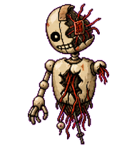<br>**Battle-Damaged Idle** | 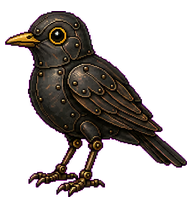<br>**Blackbird** | 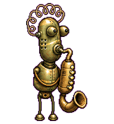<br>**Brass Reed** | 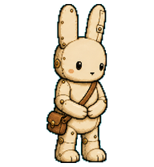<br>**Brassbun** | 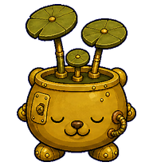<br>**Brassprout** | 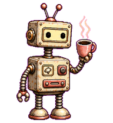<br>**Brew** |
| 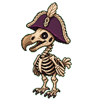<br>**Brigbeak** | 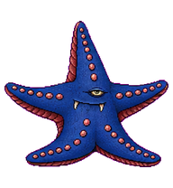<br>**Brine Star** | 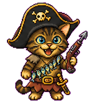<br>**Brinepaw** | 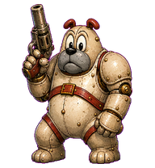<br>**Bruno** | 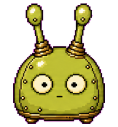<br>**Budley** | 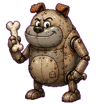<br>**Butch Dog** |
| 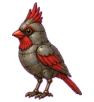<br>**Cardinal** | 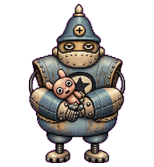<br>**Castle Guard** | 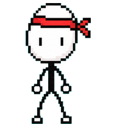<br>**Climber** | 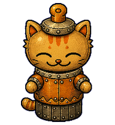<br>**Copper Cat** | 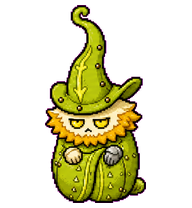<br>**Curlcap** | 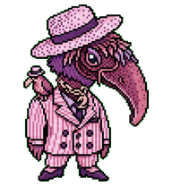<br>**Dandy Beak** |
| 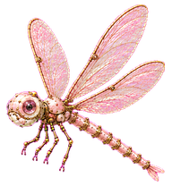<br>**Dart** | 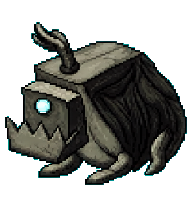<br>**Dog Creak** | 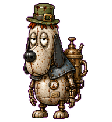<br>**Droopy-7** | 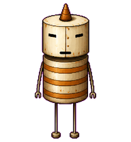<br>**Fat Robot** | 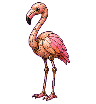<br>**flamingo** | 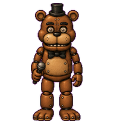<br>**Freddy Machi** |
| 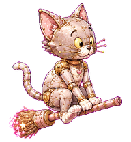<br>**Glint** | 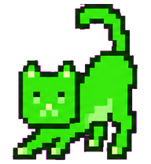<br>**Glowtail** | 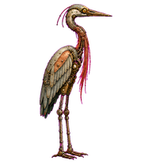<br>**Heron** | 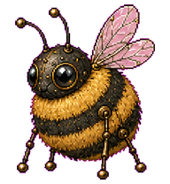<br>**Honeybee** | <br>**Inkbit** | 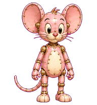<br>**Jem** |
| 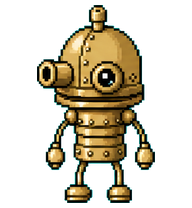<br>**Josef Bot** | 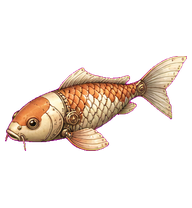<br>**Koi** | 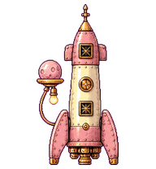<br>**Luna** | 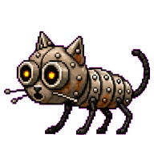<br>**Machi Cat** | 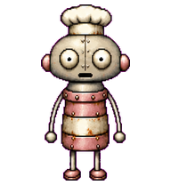<br>**Machi Chef** | 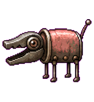<br>**Machi Dog** |
| 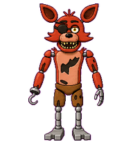<br>**Machi Foxy** | 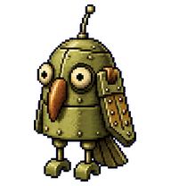<br>**Machi Owl** | 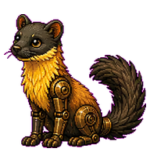<br>**Marten** | <br>**Mean Guard** | 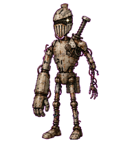<br>**Mechanical Maze Knight** | 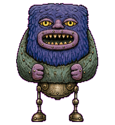<br>**Moss Maw** |
| 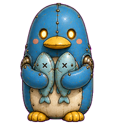<br>**Pebb** | 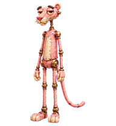<br>**Pinky** | 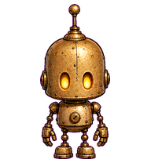<br>**Pip** | 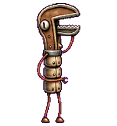<br>**Pipe Wrench Robot** | 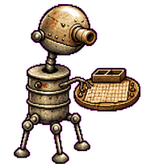<br>**Pub Player** | 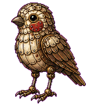<br>**Redcheek** |
| 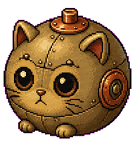<br>**Rivet Puff** | 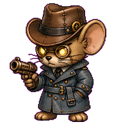<br>**Rook** | 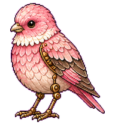<br>**Rosefinch** | <br>**Rotor Josef** | 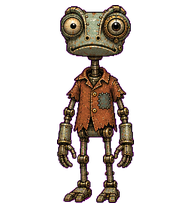<br>**Rustango** | <br>**RustBeak** |
| <br>**Rustveil** | <br>**Samorost Boxbot** | <br>**Scarlet Ibis** | <br>**Scrapling** | <br>**Scrib** | <br>**Skipp** |
| <br>**Smoking Robot** | <br>**Snoo** | <br>**Spike** | <br>**Split Chip** | <br>**Spot** | <br>**Springtrap Machi** |
| <br>**Stilt** | <br>**Sunny** | <br>**Tavern Lampbot** | <br>**The Drummer** | <br>**Tin Grin** | <br>**Tin Terrier** |
| <br>**Tinward** | <br>**Tomo** | <br>**tsuru** | <br>**Turaco** | <br>**velmour** | <br>**Vendo** |
| <br>**Vermora** | <br>**Wheelbox** | <br>**Whisk** | <br>**White-Eye** | <br>**Wreckling** |  |
